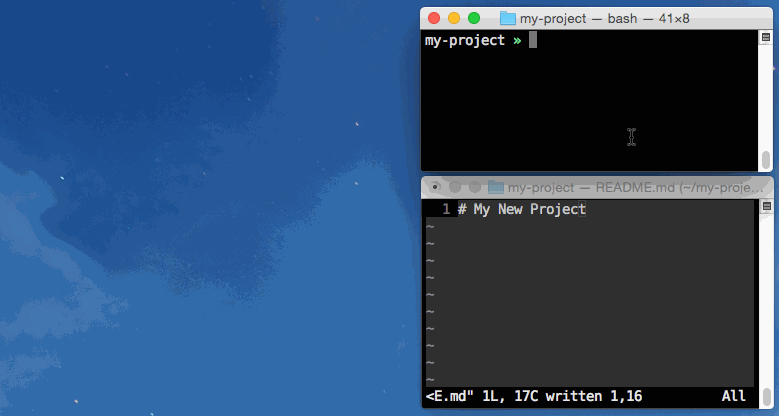

# Readme Server

`readme` is a Go app to display your readme file in your browser, enabling
you to use any editor you like and get a live preview before committing. It
searches the current working directory for any file matching `README*`, and
uses the first file it finds as the source. The view in your browser is
dynamically updated as changes are saved to the file.



# How it works

* HTTP server serves up your parsed `README.md` file
* Filesystem watches provide fast updates whenever your README changes
* Long-polling makes your changes visible almost instantly in the browser
* `open` command on most systems allows launching a browser window

# Installing

Assuming you have Golang all set up:

```
go get github.com/ryanuber/readme-server
go build -o ./readme github.com/ryanuber/readme-server
```

# Usage

There is only a single command to start the server. Against all odds, its name
is `readme`:

```
usage: readme [options]

Starts an HTTP server to display live updates to your README file.
By default, the current working directory is searched for a file
with the prefix 'README'. The file can be specified explicilty by
passing an additional argument with the path to the desired file.

Options:
  -port=<number>  The port number to start the server on.
  -dont-open      Do not automatically open the page in a browser
```

You can stop the server using `ctrl+c`.

# Limitations

This project is geared toward README generation only. It currently only supports
rendering a single file, so if there are links to other markdown files, they
will not be functional.
